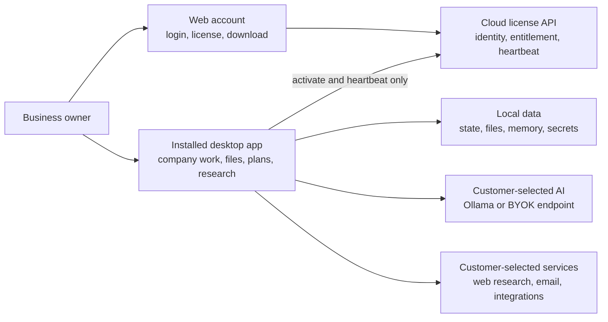

# Co-Op

Co-Op is local-first business management software for company planning, research, files, customer work, and operational decisions. The installed desktop app owns the business workspace. The cloud backend owns account identity and license entitlement.

The product is designed for business owners, not developers. Daily work should feel like using private business software, while technical choices such as model providers, local storage, review gates, and license validation stay behind clear setup screens and documentation.

## Product Boundary



Cloud services are intentionally narrow. Customer prompts, outputs, company files, provider keys, outreach content, and local run history stay on the installed machine unless the customer explicitly routes work to a configured external provider.

## What Is Included

- Public web site, login, account center, download page, legal pages, and admin license console.
- NestJS license backend for license generation, customer key revocation, activation, heartbeat, deactivation, health checks, and existing-user backfill.
- Tauri desktop app for onboarding, company profile, private files, local search, business memory, advisor chat, work plans, research, customers, outreach, pitch review, calculators, ownership tools, settings, and license status.
- Local-first model routing through Ollama or an OpenAI-compatible bring-your-own-key endpoint.
- Optional local configuration for Firecrawl web research and Resend or SendGrid email sending.
- Documentation for architecture, licensing, orchestration, operations, data boundaries, positioning, audits, and contribution rules.

## What Is Not Included

- A hosted business dashboard for customer workflow execution.
- A mobile wrapper.
- A hosted document or chat service.
- A separate mandatory vector service.
- Any cloud path that stores raw license keys, activation tokens, provider keys, prompts, files, or customer outputs.

Those areas should not be reintroduced without a recorded product decision.

## Repository Layout

```text
backend/              NestJS cloud license control plane
frontend/             Next.js web app and Tauri desktop UI
frontend/src-tauri/   Rust runtime for local activation, storage, providers, and workflows
docs/                 Architecture, operations, licensing, data, and product references
AGENTS.md             Operating contract for humans and coding agents
```

Important implementation anchors:

- `backend/src/modules/licenses/` contains activation, heartbeat, deactivation, self-service, and admin license flows.
- `backend/src/database/schema/licenses.schema.ts` is the cloud license schema source of truth.
- `frontend/src/app/` contains public web routes, account routes, admin routes, legal pages, and the desktop route.
- `frontend/src/components/desktop/` contains the installed desktop UI modules.
- `frontend/src/lib/desktop/runtime/` contains the typed client boundary between React and Tauri.
- `frontend/src-tauri/src/` contains local runtime modules for licensing, settings, workspace, chat, files, research, outreach, tools, providers, storage, validation, security, and secrets.

## Hosted Web And Desktop Separation

The hosted web application is for marketing, authentication, account management, download, and admin licensing. It must not expose the installed desktop app as a hosted production product.

Production web builds block `/desktop` and `/local` routes. Desktop builds set the Tauri export environment so the installed app can render the local shell from the bundled static files.

## Prerequisites

- Node.js 20 or newer.
- npm 10 or newer.
- Rust stable.
- Tauri system prerequisites for the target operating system.
- PostgreSQL-compatible database for the backend.
- Supabase project for cloud authentication.

## Backend Setup

```bash
cd backend
npm install
cp .env.example .env
npm run db:migrate
npm run dev
```

Required backend variables:

| Variable | Purpose |
| --- | --- |
| `DATABASE_URL` | PostgreSQL connection string. |
| `DATABASE_SSL_REJECT_UNAUTHORIZED` | Set to `true` in production unless the database provider requires a documented exception. |
| `SUPABASE_URL` | Supabase project URL. |
| `SUPABASE_ANON_KEY` | Supabase public anon key used to verify user sessions. |
| `LICENSE_KEY_PEPPER` | Strong server secret used for keyed license and activation-token hashes. |
| `CORS_ORIGINS` | Comma-separated trusted web origins in production. |
| `LICENSE_OFFLINE_GRACE_DAYS` | Optional desktop offline grace window. |
| `SUPABASE_SERVICE_KEY` | Optional one-off key for existing-user license backfills. |

## Frontend And Desktop Setup

```bash
cd frontend
npm install
cp .env.example .env.local
npm run dev
```

Required frontend variables:

| Variable | Purpose |
| --- | --- |
| `NEXT_PUBLIC_SUPABASE_URL` | Supabase project URL for browser auth. |
| `NEXT_PUBLIC_SUPABASE_ANON_KEY` | Supabase browser anon key. |
| `NEXT_PUBLIC_API_URL` | Backend API URL, usually ending in `/api/v1`. |
| `NEXT_PUBLIC_APP_URL` | Public web app URL. |
| `COOP_CLOUD_URL` | Optional desktop build override for the cloud origin. |

Desktop development:

```bash
cd frontend
npm run tauri:dev
```

Desktop release build:

```bash
cd frontend
npm run build:tauri
npm run tauri:build
```

Release installers are written under `frontend/src-tauri/target/release/bundle/`.

## Verification

Run the narrow checks while iterating. Before shipping product changes, run the full suite:

```bash
cd backend
npm test
npm run build
npm audit --audit-level=low

cd ../frontend
npm run typecheck
npm run build
npm run build:tauri
npm audit --audit-level=low
npm run audit:rust

cd src-tauri
cargo test
cargo clippy --all-targets -- -D warnings
```

When a desktop installer is expected, also run:

```bash
cd frontend
npm run tauri:build
```

## Security Principles

- Never log raw license keys, activation tokens, provider keys, prompts, files, or customer outputs.
- Store backend license keys and activation tokens only as keyed hashes.
- Store desktop activation tokens and provider keys in OS credential storage.
- Keep business workflows local to the installed app.
- Require explicit customer configuration before routing work to an external AI, research, email, or integration provider.
- Keep production CORS restricted to known origins.
- Keep `/desktop` and `/local` unavailable in hosted production web builds.

Report security issues privately to `contact@co-op.software`.

## Documentation

- `AGENTS.md` - repository operating contract.
- `docs/ARCHITECTURE.md` - cloud, web, desktop, and local runtime architecture.
- `docs/LICENSING.md` - license lifecycle, activation, heartbeat, revocation, and backfill.
- `docs/AGENT_ORCHESTRATION.md` - local advisor/workflow harness and review policy.
- `docs/DATA_PLANE.md` - local storage, file memory, and optional self-host direction.
- `docs/OPERATIONS.md` - development, deployment, release, cleanup, and incident response.
- `docs/PRODUCT_POSITIONING.md` - owner-facing language, market position, onboarding, and UX bar.
- `docs/CODEBASE_AUDIT.md` - modularity and maintainability audit.
- `docs/FEATURE_RESTORATION_AUDIT.md` - restored feature families and production hardening status.

## License

MIT
