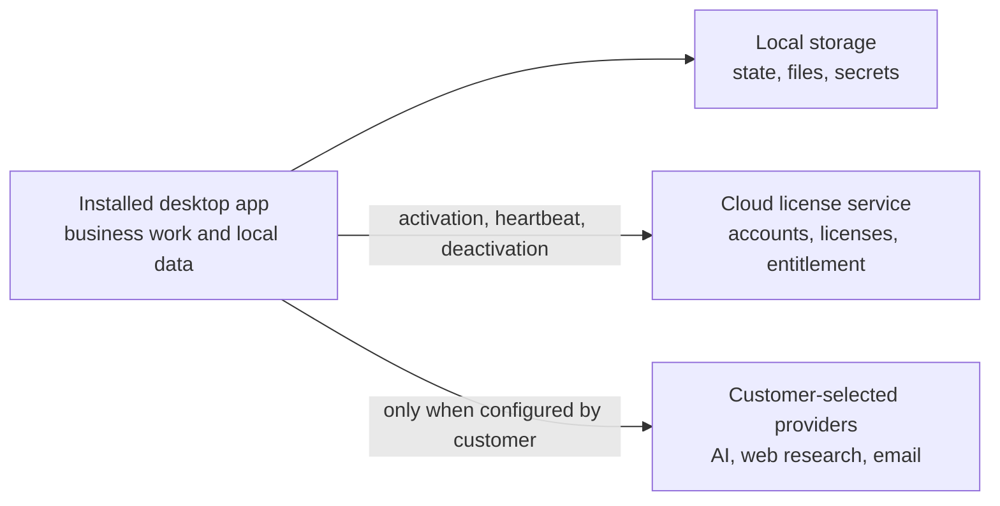

# Security

Report security issues privately to `contact@co-op.software`.

Please do not open public GitHub issues for vulnerabilities, leaked secrets, license bypasses, payment entitlement bypasses, or local data exposure reports. Include a reproduction path, affected commit or release, operating system, and whether the issue affects the cloud backend, hosted web app, or installed desktop runtime.

## Security Model

Co-Op has two main security boundaries:

The cloud backend must not receive customer workflow prompts, model outputs, company files, provider API keys, campaign content, or local run history.

## Current Protections

- Cloud authentication uses Supabase sessions.
- Admin license endpoints require a Supabase user with `app_metadata.role = "admin"`.
- License keys and activation tokens are never stored raw by the backend.
- License keys and activation tokens are stored as keyed SHA-256 HMAC hashes using `LICENSE_KEY_PEPPER`.
- Desktop activation sends a machine fingerprint hash, not raw hardware identifiers.
- Desktop activation tokens and provider API keys are stored in OS credential storage.
- Production backend startup fails without a strong `LICENSE_KEY_PEPPER`.
- Production backend startup requires explicit `CORS_ORIGINS`.
- HTTP provider URLs are validated so public insecure endpoints are rejected outside localhost/private networks.
- Frontend and backend dependency audits are part of release checks.
- Rust audit and clippy checks are part of release checks.
- Hosted production web builds block `/desktop` and `/local` routes so the installed software is not exposed as a public web dashboard.

## Secret Handling Rules

Never log, commit, paste into issues, or serialize:

- Raw license keys.
- Activation tokens.
- Supabase service role keys.
- Provider API keys.
- Firecrawl, Resend, SendGrid, or integration keys.
- Customer prompts, workflow outputs, company files, campaign content, or local run history.

If a secret is exposed, rotate it immediately and assume any dependent token or license may need revocation.

## Operator Checklist

- Use HTTPS for every production origin.
- Restrict `CORS_ORIGINS` to trusted domains.
- Keep `LICENSE_KEY_PEPPER` out of source control and logs.
- Rotate `LICENSE_KEY_PEPPER` only with a planned migration because existing license hashes depend on it.
- Keep Supabase service role keys out of browsers, desktop clients, and public logs.
- Keep Supabase admin roles tightly controlled.
- Run `npm audit --audit-level=low` in `backend/` and `frontend/`.
- Run `npm run audit:rust` from `frontend/`.
- Run `cargo clippy --all-targets -- -D warnings` from `frontend/src-tauri/`.
- Remove transient logs and generated folders before committing.

## Dependency Audit Notes

The Rust audit script carries an explicit upstream Tauri/wry GTK3/glib/unic/proc-macro advisory allowlist where patched upstream releases are not yet available. Review that allowlist on every Tauri upgrade and remove entries as soon as the dependency graph can be updated.

## Supported Versions

Security fixes target the active `main` branch and the latest desktop release artifacts produced from it. Older local builds should be updated after a security release.
