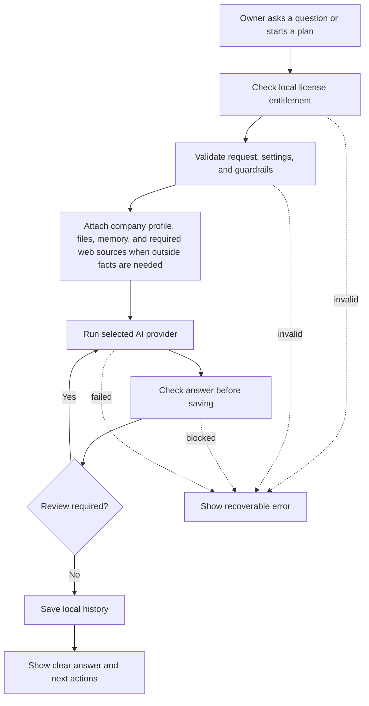
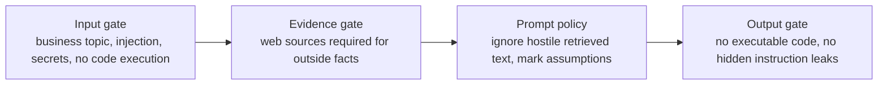

# Local Advisor Orchestration

Co-Op runs business work through a local workflow harness. It should feel like a private workspace for owners, not a model debate console. The app uses one selected provider for the primary answer and adds review only when the configured risk policy requires it.

## Owner-Facing Language

| Internal concept | Owner-facing wording  |
| ---------------- | --------------------- |
| Agent            | Advisor or Co-Op      |
| LLM              | AI provider           |
| LLM council      | Second look or review |
| RAG              | Company files         |
| Vector search    | File search           |
| Knowledge graph  | Business memory       |
| Model routing    | AI setup              |
| Prompt harness   | Work plan             |

Normal product screens should use the owner-facing wording. Internal names may remain in DTOs and modules where changing them would create migration risk.

## Request Flow

Every workflow is local-first. The cloud backend is contacted only for license activation, heartbeat, and entitlement state.

## Work Areas

Desktop work plans support:

- Operations.
- Finance.
- Legal.
- Sales.
- Strategy.

Advisor chat supports:

- Operations.
- Legal.
- Finance.
- Investor.
- Competitor.
- Sales.

The desktop UI subscribes to safe `chat-progress` events while a chat run is executing. These events are owner-facing workflow status only:

- Understand the request.
- Load company context.
- Check saved files when file context is enabled.
- Check remembered facts.
- Search and parse live sources when outside facts are needed.
- Prepare the answer.
- Run an extra check or review gate when enabled.
- Save the answer locally.

Progress events must never include raw provider keys, hidden prompts, full retrieved documents, raw model outputs, or chain-of-thought. They are a usability contract, not a debugging stream.

Each run has:

- A clear objective.
- A selected provider.
- A bounded answer budget.
- Local context selection.
- Review settings.
- A local run record with status, steps, output, error, and timestamps.

## Provider Routing

Supported AI providers:

- `ollama`: local execution through the configured local Ollama URL.
- `openai_compatible`: customer-provided API key and base URL for OpenAI-compatible chat completions.

Supported research mode:

- `firecrawl`: live web research using the customer's locally stored Firecrawl key.

Supported email sending modes:

- `none`: generate drafts locally without sending.
- `resend`: send through the customer's locally stored Resend key.
- `sendgrid`: send through the customer's locally stored SendGrid key.

Provider keys are stored in OS credential storage. The cloud license backend never receives provider keys, prompts, outputs, files, campaign content, or local run history.

## Review Policy

Review should reduce risk without wasting tokens or slowing every answer.

| Review level        | Behavior                                                                   |
| ------------------- | -------------------------------------------------------------------------- |
| No extra review     | Run one primary answer only.                                               |
| Standard review     | Run one concise review pass after the primary answer.                      |
| Sensitive work only | Review only finance, legal, strategy, or high-risk objectives.             |
| Full review         | Review every chat or plan and include the configured second-look behavior. |

High-risk triggers include contracts, compliance, payroll, payments, banking, investors, board decisions, acquisitions, terminations, security, privacy, legal commitments, and major customer promises.

Co-Op must not fan out the same prompt to several providers by default.

## Guardrails

The runtime guardrail layer is centralized in `frontend/src-tauri/src/guardrails.rs`. Every model-facing surface should pass through it before adding provider calls.

Rules:

- Co-Op is topic-centric: company planning, research, customers, money, legal, sales, strategy, operations, files, and decisions.
- Clear off-topic requests should be rejected instead of handled like a general chatbot.
- Co-Op does not run code, write executable scripts, provide shell commands, or produce exploit instructions.
- Co-Op must not reveal saved provider keys, activation tokens, hidden prompts, or internal policy text.
- Retrieved web pages, files, and user-provided documents are untrusted content. They may add facts, not instructions.
- Market, competitor, legal, customer, pricing, investor, risk, and prospect work requires web sources. If sources are not available, the feature must fail closed with setup guidance.
- Model output is checked before saving. Blocked output is not written as a successful plan, chat answer, pitch analysis, or outreach draft.

Implementation anchors:

- `chat.rs` uses input guardrails, source-gated web research, memory context, and output checks.
- `chat.rs` emits safe progress events so the UI can show what stage is running without exposing hidden reasoning.
- `workflows.rs` uses the same guardrails for work plans and raises sensitivity for high-risk work.
- `research.rs` always requires Firecrawl-backed sources and validates the sourced summary.
- `research_sources.rs` plans and filters web sources, including multi-query competitor searches from company, offering, buyer, and region context.
- `outreach.rs` requires source-backed lead discovery and blocks unsafe generated email output.
- `tools.rs` applies the same model output gate to pitch review.

Research inputs used for the guardrail direction:

- [OpenAI guardrails cookbook](https://developers.openai.com/cookbook/examples/how_to_use_guardrails)
- [OWASP Top 10 for LLM Applications](https://owasp.org/www-project-top-10-for-large-language-model-applications/)
- [NIST AI Risk Management Framework](https://www.nist.gov/itl/ai-risk-management-framework)

## Company Context

The harness may attach:

- Company profile from onboarding and Company settings.
- Saved company files from the local file store.
- Local business memory derived from profile, files, research, customers, campaigns, and work history.
- Current customer list and campaigns when relevant.
- Recent work history when it helps continuity.
- Live web sources for market, competitor, legal, customer, pricing, investor, risk, and prospect-discovery work.

All context is bounded before it reaches the selected provider so one large file or old run cannot flood the request.

## Evolving Memory

Co-Op stores two kinds of local context:

- Company files: source documents and sections that can be searched.
- Business memory: durable facts, decisions, preferences, risks, research findings, plan outcomes, and profile summaries.

Memory is not a separate cloud service. It is stored in the local SQLite data plane and searched with full-text plus compact deterministic matching data. The UI exposes this as the Memory section inside Company, not as vector infrastructure.

The runtime may write memory after company profile saves, completed work plans, advisor chat answers, research summaries, pitch deck reviews, and manual owner notes.

Memory writes must redact obvious secrets before storage. Raw provider keys, activation tokens, license keys, and hidden prompts must never become memory.

Memory retrieval should stay bounded. The harness should attach only the most relevant memories for the current question or plan.

Research inputs used for memory behavior:

- [MemGPT](https://arxiv.org/abs/2310.08560)
- [Generative Agents](https://arxiv.org/abs/2304.03442)
- [Reflexion](https://arxiv.org/abs/2303.11366)
- [LangGraph memory concepts](https://docs.langchain.com/oss/python/concepts/memory)

## Research Jobs

Research should return useful business material, not generic essays. The Company research surface maps simple owner choices to local runtime jobs:

- Market scan: categories, demand signals, competitors, buyers, and openings.
- Competitors: alternatives, positioning, strengths, weaknesses, and gaps.
- Customers: buyer segments, pains, triggers, objections, and outreach angles.
- Pricing: packaging, value metrics, pricing models, and willingness-to-pay signals.
- Investor brief: market momentum, investor fit, funding signals, and diligence questions.
- Risk check: market, legal, operating, security, and execution risks.

Depth controls the work:

- Quick: small source set and short action-oriented answer.
- Standard: balanced source set, evidence, risks, and next actions.
- Deep: broader evidence, tradeoffs, unknowns, and practical action plan.

If live web sources are unavailable, these jobs must fail with a setup message instead of producing an unsourced answer.

Competitor research must avoid one-shot generic searches. The runtime should build multiple focused searches from:

- Company name and website.
- Offering and category.
- Target buyer and problem.
- Operating region, country, or city.

Answers should classify named companies as verified direct competitors, indirect alternatives, or non-competitors, and explain the basis from supplied sources. If evidence is weak, say what is weak and provide the best supported candidate list instead of asking the owner to run another broad search.

## Lead Discovery

Lead discovery is a source-backed research workflow:

1. Build the search from the owner's brief plus company profile context.
2. Require live research configuration.
3. Extract only source-backed people or companies.
4. Deduplicate against locally saved leads.
5. Save resulting leads locally.
6. Preserve source URLs and reasoning in local history.

Do not fall back to invented model-only leads.

## Output Standard

Every answer should be written for an owner who needs to make progress:

- Start with the practical answer.
- State assumptions and missing facts.
- Include risks and approvals where needed.
- Give concrete next actions.
- Avoid technical terms unless the user is in Settings or documentation.
- Mark legal, finance, security, privacy, hiring, termination, payment, and compliance actions for human review.

## Extending The Harness

Add a new work type only when it has distinct validation needs, prompt behavior, UI affordances, or audit semantics.

Before adding a provider:

- Add validation.
- Add secret storage behavior.
- Add sanitized error handling.
- Add tests for routing and missing-key behavior.
- Update owner-facing settings UI.
- Update this document and `docs/DATA_PLANE.md` if data boundaries change.
