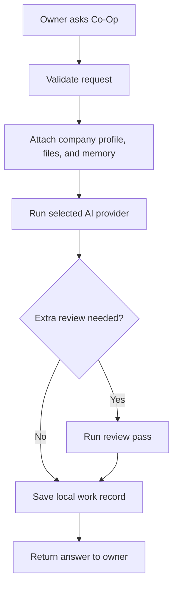

# Advisor Orchestration

Co-Op is a business operations harness, not a token-burning model debate product. The runtime uses one selected provider for the primary work plan and only adds review when the configured risk policy requires it.

The user-facing product should call these areas "advisors" and "review" instead of exposing implementation terms. Internal DTO names may stay stable for migration compatibility, but the interface should stay business-owner friendly.

## Work Surface

The desktop runtime accepts these work areas:

- `operations`
- `finance`
- `legal`
- `sales`
- `strategy`

Each work plan has a clear objective, a selected provider, a bounded answer budget, a local audit entry, and a concrete result or error. Objectives are validated before execution so empty or oversized requests never reach a provider.

The desktop chat surface supports these advisor areas:

- `operations`
- `legal`
- `finance`
- `investor`
- `competitor`
- `sales`

Each chat session can independently enable second-look review, company file context, live research context, and final review.

## Provider Routing

Supported provider modes:

- `ollama`: default local execution through `http://localhost:11434`.
- `openai_compatible`: customer-supplied API key and base URL for OpenAI-compatible chat completions.

Provider settings are stored by the desktop runtime. Provider API keys are written to OS credential storage, and the cloud backend does not receive provider API keys, work prompts, or work outputs.

Supported research modes:

- `llm`: model-only research synthesis using the configured local/BYOK provider.
- `firecrawl`: live web research using the customer's locally stored Firecrawl key.

The desktop Research tab exposes owner-friendly research jobs that map to the same local runtime:

- Market scan: trends, categories, demand signals, competitors, buyers, and openings.
- Competitors: alternatives, positioning, strengths, weaknesses, and gaps.
- Customers: buyer segments, pains, triggers, objections, and outreach angles.
- Pricing: packaging, value metrics, pricing models, and willingness-to-pay signals.
- Investor brief: market momentum, investor fit, funding signals, and diligence questions.
- Risk check: market, legal, operating, security, and execution risks.

Research depth controls source volume and output length:

- Quick: 3 live sources when web research is enabled; short bullets and one next move.
- Standard: 5 live sources; key findings, evidence, risks, and next actions.
- Deep: 8 live sources; grouped evidence, tradeoffs, uncertainties, and a practical action plan.

Research outputs must be written for business owners, not analysts or developers. Reports should use plain language and stable sections: quick answer, what matters, evidence, risks or unknowns, and next moves. If live sources are unavailable, the output must clearly state that it is assistant-only and avoid invented citations.

Lead discovery is a web-search workflow. It must use `firecrawl` research, build the search from the owner's brief plus company profile context, extract only source-backed people or companies, dedupe against locally saved leads, and store the resulting leads locally. Do not fall back to model-only lead invention.

Supported campaign email modes:

- `none`: campaign emails can be generated locally but not sent.
- `resend`: sends through the customer's locally stored Resend key.
- `sendgrid`: sends through the customer's locally stored SendGrid key.

## Review Policy

Review level is a guardrail:

- No extra review: run only the primary response.
- Standard review: run one concise review pass after the primary response.
- Sensitive work only: run the review pass only for sensitive work areas or risky objectives.
- Full review: run the review gate for every chat/work request and include second-look review when enabled in chat.

High-risk review currently applies to `finance`, `legal`, and `strategy`, plus operational or sales objectives involving contracts, compliance, payroll, payments, banking, investors, board decisions, acquisitions, terminations, security, or privacy.

This keeps cost and latency reasonable. Co-Op must not fan out the same prompt to several models by default.

## Runtime Contract

Every work run should:

- Check the local license state before work starts.
- Validate the work type and objective length.
- Load the configured provider policy.
- Attach local business memory so decisions can reference company entities and relationships.
- Build a business-focused system prompt with privacy and human-approval guidance.
- Run through the selected provider.
- Apply the review gate only when policy requires it.
- Store the latest run history locally, including status, steps, output, error, and timestamps.

Every chat run should:

- Load startup workspace context.
- Attach local business memory derived from workspace, files, research, outreach, campaigns, and work history.
- Attach local company file context when enabled.
- Attach live Firecrawl research context when enabled and configured.
- Run the selected advisor prompt.
- Run second-look review when enabled.
- Run final review when configured.
- Store the entire session locally.
- Respect local retention caps so chat and research history cannot grow without bound.

## Output Standard

Workflow output should be actionable business material:

- Decisions, assumptions, risks, and next actions should be explicit.
- Legal, finance, security, privacy, hiring, termination, payment, and compliance actions should be marked for human approval.
- Missing facts should be requested instead of invented.
- Sensitive business data should stay local unless the customer intentionally routes it to a configured external provider.

## Extending The Harness

Add a new work type only when it has distinct validation needs, prompt behavior, UI affordances, or audit semantics. Keep provider adapters behind the existing routing contract so the local app remains the execution boundary.
