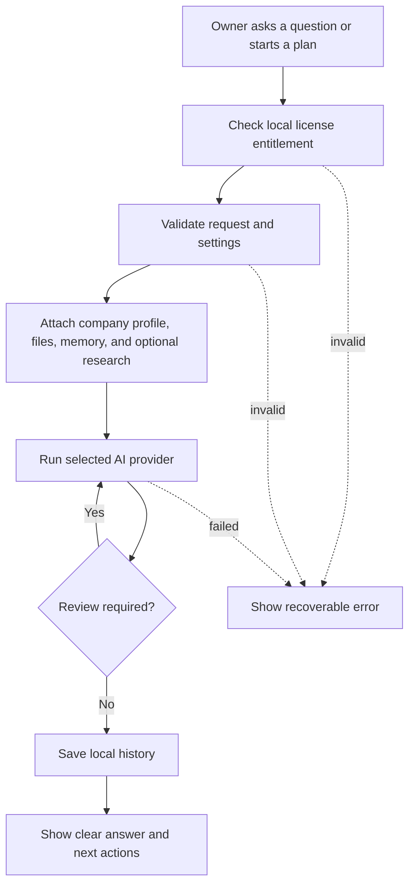

# Local Advisor Orchestration

Co-Op runs business work through a local workflow harness. It should feel like a private workspace for owners, not a model debate console. The app uses one selected provider for the primary answer and adds review only when the configured risk policy requires it.

## Owner-Facing Language

| Internal concept | Owner-facing wording |
| --- | --- |
| Agent | Advisor or Co-Op |
| LLM | AI provider |
| LLM council | Second look or review |
| RAG | Company files |
| Vector search | File search |
| Knowledge graph | Business memory |
| Model routing | AI setup |
| Prompt harness | Work plan |

Normal product screens should use the owner-facing wording. Internal names may remain in DTOs and modules where changing them would create migration risk.

## Request Flow

Every workflow is local-first. The cloud backend is contacted only for license activation, heartbeat, and entitlement state.

## Work Areas

Desktop work plans support:

- Operations.
- Finance.
- Legal.
- Sales.
- Strategy.

Advisor chat supports:

- Operations.
- Legal.
- Finance.
- Investor.
- Competitor.
- Sales.

Each run has:

- A clear objective.
- A selected provider.
- A bounded answer budget.
- Local context selection.
- Review settings.
- A local run record with status, steps, output, error, and timestamps.

## Provider Routing

Supported AI providers:

- `ollama`: local execution through the configured local Ollama URL.
- `openai_compatible`: customer-provided API key and base URL for OpenAI-compatible chat completions.

Supported research modes:

- `llm`: synthesis using the configured AI provider without live web sources.
- `firecrawl`: live web research using the customer's locally stored Firecrawl key.

Supported email sending modes:

- `none`: generate drafts locally without sending.
- `resend`: send through the customer's locally stored Resend key.
- `sendgrid`: send through the customer's locally stored SendGrid key.

Provider keys are stored in OS credential storage. The cloud license backend never receives provider keys, prompts, outputs, files, campaign content, or local run history.

## Review Policy

Review should reduce risk without wasting tokens or slowing every answer.

| Review level | Behavior |
| --- | --- |
| No extra review | Run one primary answer only. |
| Standard review | Run one concise review pass after the primary answer. |
| Sensitive work only | Review only finance, legal, strategy, or high-risk objectives. |
| Full review | Review every chat or plan and include the configured second-look behavior. |

High-risk triggers include contracts, compliance, payroll, payments, banking, investors, board decisions, acquisitions, terminations, security, privacy, legal commitments, and major customer promises.

Co-Op must not fan out the same prompt to several providers by default.

## Company Context

The harness may attach:

- Company profile from onboarding and Company settings.
- Saved company files from the local file store.
- Local business memory derived from profile, files, research, customers, campaigns, and work history.
- Current customer list and campaigns when relevant.
- Recent work history when it helps continuity.
- Live research only when the customer enables it and configures a research provider.

All context is bounded before it reaches the selected provider so one large file or old run cannot flood the request.

## Research Jobs

Research should return useful business material, not generic essays. The desktop Research tab maps simple owner choices to local runtime jobs:

- Market scan: categories, demand signals, competitors, buyers, and openings.
- Competitors: alternatives, positioning, strengths, weaknesses, and gaps.
- Customers: buyer segments, pains, triggers, objections, and outreach angles.
- Pricing: packaging, value metrics, pricing models, and willingness-to-pay signals.
- Investor brief: market momentum, investor fit, funding signals, and diligence questions.
- Risk check: market, legal, operating, security, and execution risks.

Depth controls the work:

- Quick: small source set and short action-oriented answer.
- Standard: balanced source set, evidence, risks, and next actions.
- Deep: broader evidence, tradeoffs, unknowns, and practical action plan.

If live web sources are unavailable, the output must clearly state that it is based on the configured assistant only and must not invent citations.

## Lead Discovery

Lead discovery is a source-backed research workflow:

1. Build the search from the owner's brief plus company profile context.
2. Require live research configuration.
3. Extract only source-backed people or companies.
4. Deduplicate against locally saved leads.
5. Save resulting leads locally.
6. Preserve source URLs and reasoning in local history.

Do not fall back to invented model-only leads.

## Output Standard

Every answer should be written for an owner who needs to make progress:

- Start with the practical answer.
- State assumptions and missing facts.
- Include risks and approvals where needed.
- Give concrete next actions.
- Avoid technical terms unless the user is in Settings or documentation.
- Mark legal, finance, security, privacy, hiring, termination, payment, and compliance actions for human review.

## Extending The Harness

Add a new work type only when it has distinct validation needs, prompt behavior, UI affordances, or audit semantics.

Before adding a provider:

- Add validation.
- Add secret storage behavior.
- Add sanitized error handling.
- Add tests for routing and missing-key behavior.
- Update owner-facing settings UI.
- Update this document and `docs/DATA_PLANE.md` if data boundaries change.
