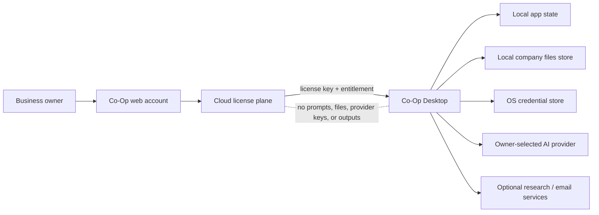
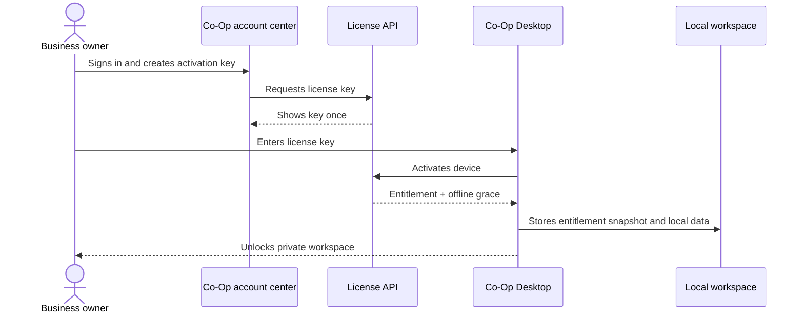

# Architecture

Co-Op is split into a cloud license plane and a local desktop business workspace.

See `docs/DATA_PLANE.md` for the local storage and optional self-host data decisions.

## Planes

Cloud license plane:

- Authenticates cloud users through Supabase sessions.
- Protects admin license generation and listing.
- Stores license, activation, and license event records.
- Accepts desktop activation, heartbeat, and deactivation calls.
- Enforces license status, expiry, device limits, and offline grace windows.

Local desktop data plane:

- Stores activation metadata in the Tauri app data directory and activation/provider secrets in OS credential storage.
- Stores model routing settings locally.
- Stores startup workspace, chat sessions, research runs, outreach data, campaigns, investor records, alerts, pitch analyses, cap tables, bookmarks, integrations, work history, and file summaries in local app state.
- Stores company file content, sections, search rows, and compact matching data in a local SQLite knowledge store.
- Runs business work plans, advisor chat, second-look review, company file search, business memory context, research synthesis, pitch analysis, personalized outreach, and tools through Ollama or a customer-configured OpenAI-compatible provider.
- Uses customer-configured Firecrawl for live web research when enabled.
- Uses customer-configured Resend or SendGrid keys for campaign email sending when enabled.
- Sends the cloud backend only license and heartbeat data.

## Request Flow

1. An admin creates a license from `/admin/licenses`.
2. The backend stores only a keyed hash of the generated license key and returns the raw key once.
3. The customer installs Co-Op Desktop and activates with the license key only.
4. The desktop runtime sends the key, hashed machine fingerprint, generated device label, and install ID to `POST /api/v1/licenses/activate`.
5. The backend returns an activation token and entitlement payload.
6. The desktop runtime stores entitlement metadata locally and stores the activation token in OS credential storage.
7. Heartbeats call `POST /api/v1/licenses/heartbeat` to refresh entitlement and offline grace.
8. Business work plans and product features run locally after entitlement is checked.

## Backend Components

- `main.ts` configures HTTP security, explicit production CORS, request IDs, validation, and the `/api/v1` prefix.
- `ThrottlerGuard` is installed globally so all endpoints share the configured rate-limit policy.
- `HealthModule` exposes health checks.
- `LicensesModule` exposes admin and desktop license endpoints.
- `AdminGuard` requires a Supabase user with `app_metadata.role = "admin"`.
- `license-crypto.ts` generates license keys and hashes license keys and activation tokens.
- Drizzle schema files define `licenses`, `license_activations`, and `license_events`.

## Frontend Components

- `/` presents the local-first desktop product.
- `/login` handles cloud account sign-in.
- `/download` gives customers the software download entry point.
- `/account` is the authenticated customer center for activation-key generation.
- `/activate` is a narrow desktop activation fallback route.
- `/desktop` is the installed Tauri software shell.
- `/admin/licenses` lets admins generate and inspect licenses.
- `src/lib/api/client.ts` talks to the cloud license API.
- `src/lib/desktop/runtime.ts` wraps Tauri command calls.
- `src-tauri/build.rs` embeds `COOP_CLOUD_URL` or `NEXT_PUBLIC_API_URL` into the desktop binary so activation asks business users only for the license key.

## Desktop Runtime Components

Tauri commands:

- `get_activation_state`
- `activate_license`
- `heartbeat_license`
- `clear_activation`
- `save_model_settings`
- `save_workspace_profile`
- `run_agent_chat`
- `add_knowledge_document`
- `search_knowledge`
- `get_knowledge_graph`
- `run_research_query`
- `create_lead`
- `discover_leads`
- `create_campaign`
- `generate_campaign_emails`
- `send_campaign_emails`
- `save_alert`
- `run_alert_now`
- `analyze_pitch_deck`
- `save_cap_table`
- `run_calculator`
- `save_bookmark`
- `save_integration`
- `run_business_workflow`
- `get_machine_fingerprint`

The runtime is modularized across license, settings, workspace, chat, file memory, business memory, research, outreach, tools, providers, storage, validation, security, secrets, types, and constants modules. It validates URLs, providers, model names, answer budgets, work types, workspace profile fields, document sizes, email addresses, cap-table percentages, calculators, campaign email length, and objective length before persistence or network calls.

## Storage Boundaries

Cloud database:

- License metadata
- License hashes
- Activation token hashes
- Device activation rows
- License event audit rows

Desktop app data:

- Entitlement snapshot
- Machine fingerprint hash
- Provider settings
- Startup workspace
- Chat sessions
- Company file summaries in `state.json`
- Company file content, sections, search rows, and binary matching data in `knowledge.sqlite3`
- Derived local business memory snapshots
- Research runs
- Outreach leads, campaigns, generated emails, and send status
- Investor records
- Alerts
- Pitch deck analyses
- Cap table scenarios
- Bookmarks
- Integrations
- Workflow run history

OS credential storage:

- Activation token
- Bring-your-own-key provider API key
- Firecrawl key
- Email-provider key

## Scaling Model

The cloud API scales horizontally because it is stateless outside PostgreSQL/Supabase and request validation. License activation depends on database uniqueness constraints for active device binding. Workflow load scales with the customer's desktop machine or selected provider, not with the Co-Op cloud backend.

## Security Boundaries

- License keys are shown once and stored only as keyed hashes.
- Activation tokens are stored only as hashes in the backend.
- Machine fingerprints are hashed before leaving the desktop runtime.
- Public HTTP provider URLs are rejected outside localhost and private networks.
- Production backend startup fails without a strong `LICENSE_KEY_PEPPER` and explicit `CORS_ORIGINS`.
- Desktop state serialization excludes raw activation tokens and provider keys.
- Local state collections are capped before persistence to prevent unbounded state growth.
- Customer business prompts and outputs do not enter the cloud license plane.
