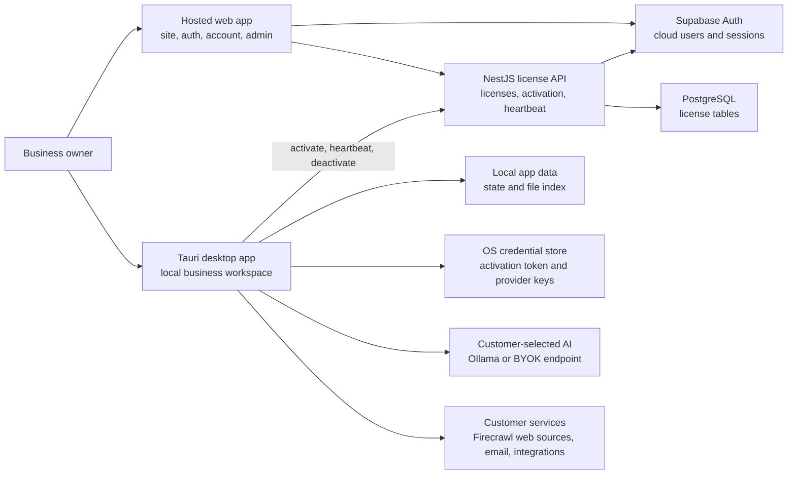
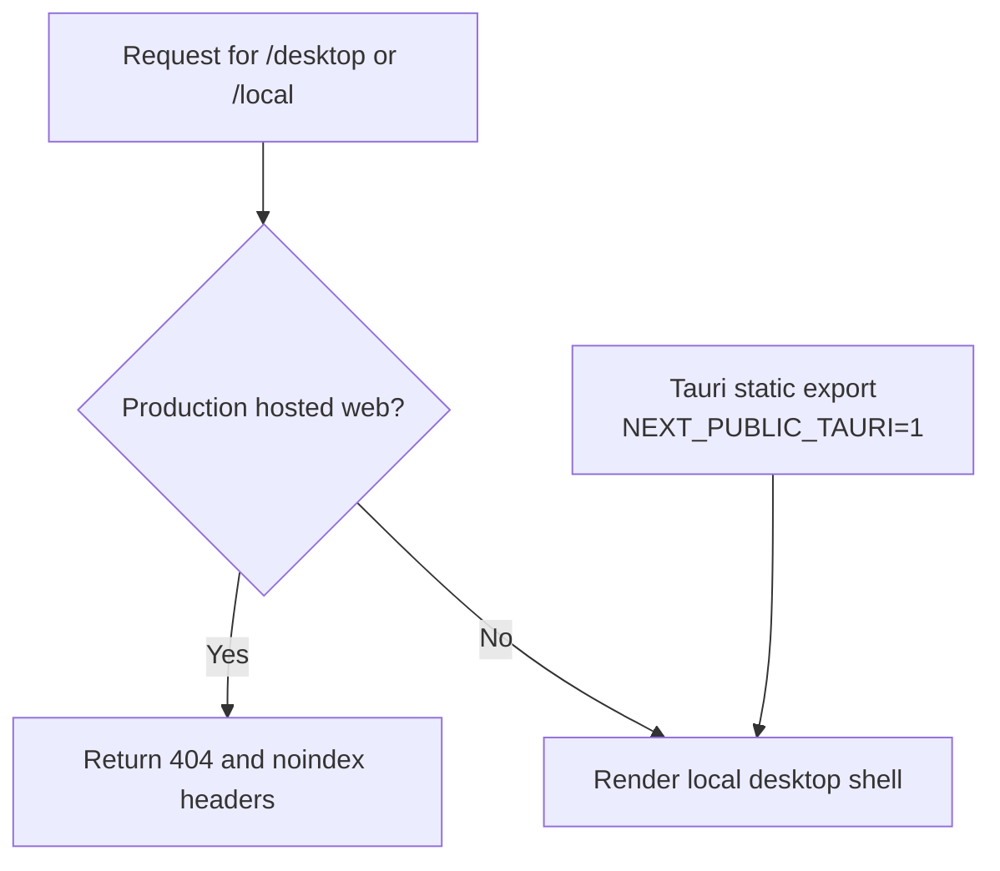
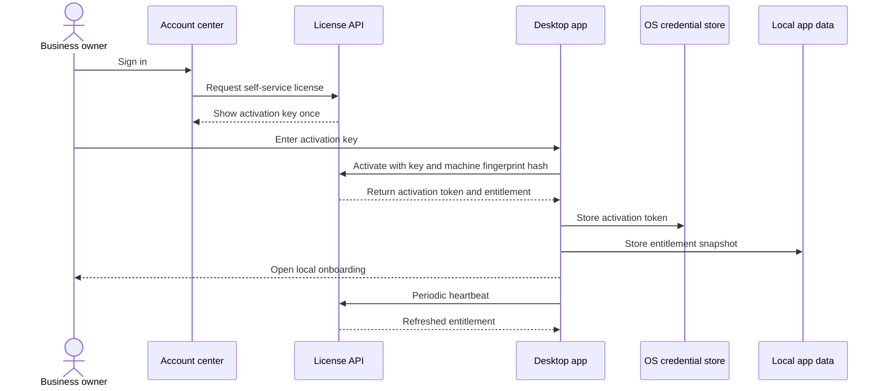
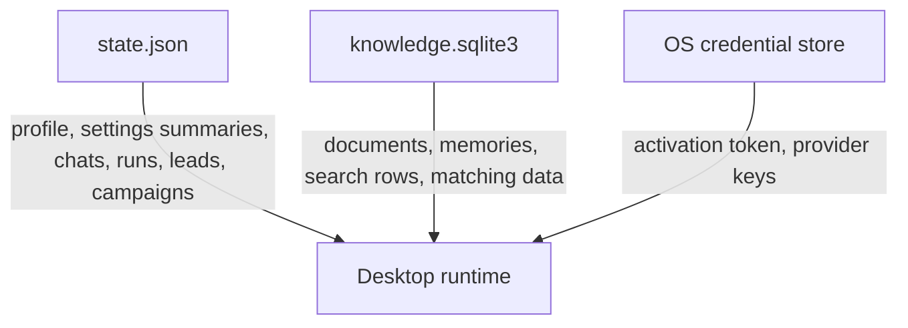

# Architecture

Co-Op is split into a hosted account and license service plus an installed desktop workspace. The hosted service proves entitlement. The installed app does the business work.

## System Overview

The cloud license API does not store workflow prompts, model outputs, company files, outreach content, provider keys, or local run history.

## Runtime Responsibilities

| Runtime             | Owns                                                                                                                                           | Must not own                                                      |
| ------------------- | ---------------------------------------------------------------------------------------------------------------------------------------------- | ----------------------------------------------------------------- |
| Hosted web app      | Landing page, login, account center, software download, legal pages, admin license console                                                     | Customer business workflow execution                              |
| Cloud backend       | Health checks, license creation, self-service license lookup, activation, heartbeat, deactivation, revocation hooks, payment entitlement hooks | Business prompts, files, outputs, provider keys, campaign content |
| Desktop app         | Company onboarding, profile, files, local search, advisor chat, plans, research, customers, outreach, tools, settings, local run history       | Account identity or license generation authority                  |
| Local storage       | Entitlement snapshot, company state, file index, local business memory, provider settings summaries                                            | Raw secrets in plaintext state files                              |
| OS credential store | Activation token and customer provider keys                                                                                                    | Searchable business data                                          |

## Hosted Web Route Boundary

`/desktop` and `/local` are not public production web products. They exist so the same Next.js code can render inside the Tauri bundle and during local development.

Production protection is implemented at both the route and proxy layers:

- `frontend/src/app/desktop/page.tsx` returns `notFound()` for hosted production builds.
- `frontend/src/proxy.ts` blocks `/desktop`, `/desktop/*`, `/local`, and `/local/*` in hosted production mode.
- Desktop export/build scripts set the Tauri environment so the installed bundle can render the shell.

## License Flow

The desktop activation UI asks for the activation key only. The backend URL is embedded at build time through `COOP_CLOUD_URL` or `NEXT_PUBLIC_API_URL`.

## Backend Components

- `main.ts` configures helmet, validation, request IDs, the `/api/v1` prefix, rate limiting, CORS, and production safety checks.
- `HealthModule` exposes the service health endpoint.
- `LicensesModule` exposes admin, self-service, activation, heartbeat, and deactivation flows.
- `AdminGuard` requires a verified Supabase user with `app_metadata.role = "admin"`.
- `AuthGuard` verifies Supabase sessions for account self-service routes.
- `license-crypto.ts` generates display-safe license keys and keyed hashes.
- `database/schema/licenses.schema.ts` defines `licenses`, `license_activations`, and `license_events`.
- `scripts/migrate.mjs` applies schema migrations.
- `scripts/backfill-supabase-users.mjs` creates initial licenses for existing Supabase users that do not already have one.

## Frontend Components

- `/` presents the product in owner-facing language.
- `/login` and `/signup` handle cloud account access.
- `/account` is the customer account center for license status, activation key generation, and software download.
- `/download` gives the installer entry point.
- `/activate` is a narrow browser fallback for license activation guidance.
- `/admin/licenses` is the admin license console.
- `/privacy`, `/terms`, `/security`, and `/cookies` provide public legal and trust pages.
- `/desktop` is for local development and Tauri rendering only, not hosted production access.

Desktop UI modules are under `frontend/src/components/desktop/`:

- `local-coop-shell.tsx` is the thin shell and route/state coordinator.
- `panels/` contains feature panels such as Today, Ask, Plans, Company, Files, Research, Customers, Settings, and License.
- `tools/` contains Money & Tools surfaces.
- `shared.tsx` contains reusable desktop UI primitives.
- `markdown.tsx` renders owner-facing assistant output safely and consistently.

## Tauri Runtime Components

Tauri commands are registered in `frontend/src-tauri/src/lib.rs` and delegated to focused modules:

| Module             | Responsibility                                                                                    |
| ------------------ | ------------------------------------------------------------------------------------------------- |
| `license.rs`       | Activation, heartbeat, deactivation, entitlement checks.                                          |
| `settings.rs`      | Provider, research, email, and integration settings.                                              |
| `workspace.rs`     | Company profile and onboarding state.                                                             |
| `chat.rs`          | Advisor chat, sessions, review gates, and prompt assembly.                                        |
| `rag.rs`           | Local document sectioning and compact matching data.                                              |
| `knowledge_store/` | SQLite schema, migrations, document storage, search, and tests.                                   |
| `graph.rs`         | Derived local business memory from profile, files, research, customers, and work.                 |
| `guardrails.rs`    | Business-topic, source, prompt-injection, secret-disclosure, no-code-execution, and output gates. |
| `memory.rs`        | Memory commands, profile/work/research memory capture, redaction, and context retrieval.          |
| `memory_store.rs`  | SQLite-backed business memory storage, full-text search, compact matching data, and tests.        |
| `research.rs`      | Research jobs and source-backed summaries.                                                        |
| `outreach.rs`      | Leads, campaigns, personalization, and email sending.                                             |
| `tools.rs`         | Calculators, pitch review, cap table, bookmarks, and local tools.                                 |
| `providers.rs`     | Ollama, OpenAI-compatible, Firecrawl, Resend, and SendGrid adapters.                              |
| `storage.rs`       | Local state read/write and retention caps.                                                        |
| `validation.rs`    | Input, URL, provider, objective, email, and data validation.                                      |
| `security.rs`      | Fingerprinting and safe serialization helpers.                                                    |
| `secrets.rs`       | OS credential storage.                                                                            |
| `types/`           | Typed command payloads and state DTOs split by domain.                                            |

## Local Data Stores

- `state.json` stores lightweight local app state and excludes raw secrets.
- `knowledge.sqlite3` stores local company documents, business memories, search rows, and compact matching data.
- OS credential storage keeps activation and provider secrets out of plaintext state.

## Scaling Model

The backend scales horizontally because it is stateless outside PostgreSQL/Supabase and validation. License activation uses database constraints and status checks for device binding. Business workflow load scales with the customer's machine or chosen provider rather than the Co-Op cloud backend.

The desktop storage path is embedded by default so normal customers do not need Docker or database administration. Optional team self-host memory/search services can be added later without changing the cloud license boundary.

## Security Boundaries

- License keys are shown once and stored only as keyed hashes.
- Activation tokens are stored only as keyed hashes in the backend.
- Machine fingerprints are hashed before leaving the desktop runtime.
- Provider API keys are stored locally in OS credential storage.
- Firecrawl is required for source-backed outside-fact workflows such as market, competitor, legal, customer, pricing, investor, risk, and prospect discovery.
- Guardrails reject prompt-injection attempts, secret disclosure, executable code requests, and unsafe model outputs before results are saved.
- The Tauri shell plugin is not enabled; the desktop app does not expose shell command execution.
- Public insecure provider URLs are rejected outside localhost and private networks.
- Production backend startup requires a strong `LICENSE_KEY_PEPPER` and explicit `CORS_ORIGINS`.
- Hosted production web builds block desktop routes.
- Customer business prompts, files, and outputs do not enter the cloud license plane.
