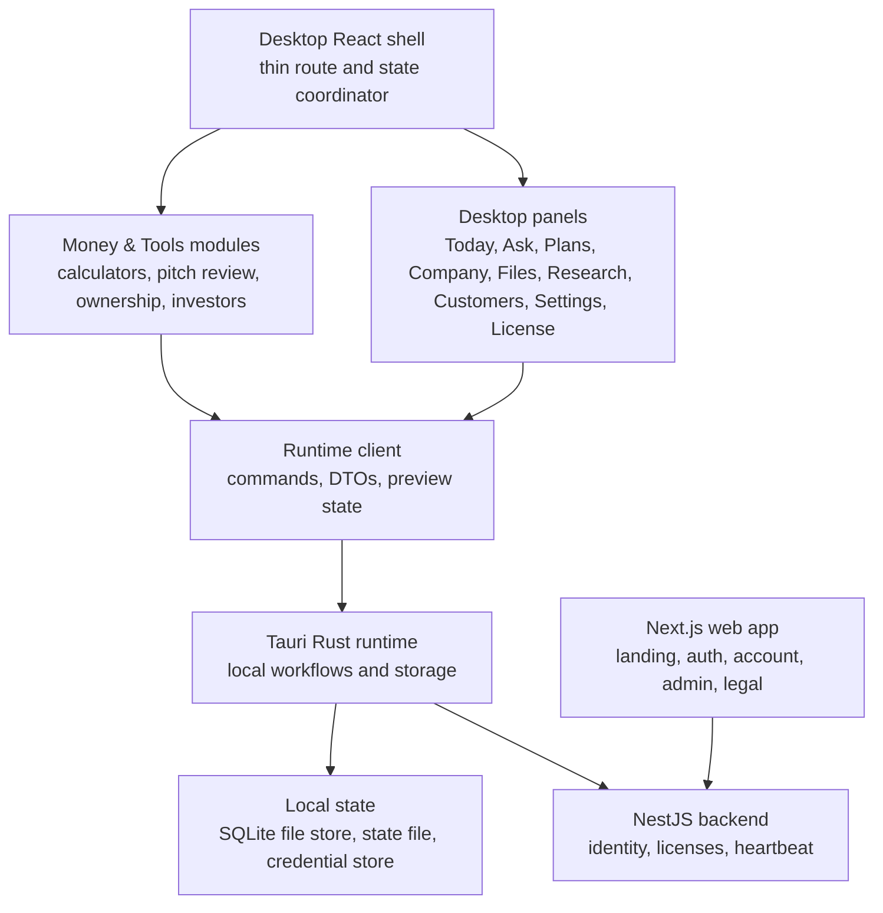

# Co-Op Codebase Audit

This audit records the maintainability boundaries for Co-Op. It is meant to keep the product shippable as a local-first desktop app with a cloud license control plane.

## Current Boundaries



## Modularization Status

Completed:

- Desktop shell split into a thin coordinator plus focused panel modules under `frontend/src/components/desktop/panels/`.
- Money & Tools split into modules under `frontend/src/components/desktop/tools/`.
- Desktop runtime client split into command wrappers, DTOs, and preview fallback state.
- Tauri DTOs split into focused modules under `frontend/src-tauri/src/types/`.
- Local knowledge store schema, migrations, and tests moved into a focused `knowledge_store/` module.
- Hosted production `/desktop` and `/local` route blocking added at route and proxy levels.
- Marketing, legal, account, admin, and desktop surfaces separated by route responsibility.

Watch:

- `frontend/src/components/desktop/local-coop-shell.tsx` should remain a coordinator only.
- `frontend/src-tauri/src/outreach.rs` should be split if more outreach providers or discovery flows are added.
- `frontend/src-tauri/src/providers.rs` should be split before adding another provider family.
- `frontend/src-tauri/src/tools.rs` should be split before adding more unrelated tools.

## Size Guardrail

Use these limits unless a deliberate exception is documented:

| Area                                        |                                               Soft limit |
| ------------------------------------------- | -------------------------------------------------------: |
| Frontend screen or panel                    |                                                300 lines |
| Shared frontend component or utility module |                                                450 lines |
| Rust or backend domain module               |                                                600 lines |
| DTO module                                  | Split by product domain before it becomes hard to review |

Large files are not automatically wrong, but they need a clear reason and a plan to avoid becoming dumping grounds.

## Dead-End Policy

Production screens must not include:

- Buttons without implemented actions.
- Fake success states.
- Placeholder provider paths.
- Demo-only data that appears as real customer data.
- Forms that ask business users for developer-only values.
- Hosted access to the desktop software shell.
- Technical terms in normal owner workflows when plain language works.

If a feature is not ready, hide it or ship a real disabled state with a specific setup requirement.

## Log And Artifact Hygiene

The repo should not contain transient local artifacts:

- `.log`
- `.err.log`
- `.tsbuildinfo`
- `.next/`
- `out/`
- `out-tauri/`
- `backend/dist/`

Release installers may exist locally under `frontend/src-tauri/target/release/bundle/` when a desktop release is being produced, but generated binaries should not be committed without a maintainer decision.

## Ongoing Audit Checklist

Run after meaningful product changes:

```bash
rg --files -g "*.log" -g "*.err.log" -g "*.tsbuildinfo"
```

Also search the changed code for unresolved work markers, placeholder paths, and inactive controls before opening a pull request.

Then run the verification commands in `docs/OPERATIONS.md`.

## Review Focus

When auditing Co-Op, prioritize:

- License bypasses.
- Secret leakage.
- Hosted desktop exposure.
- Broken activation or heartbeat flows.
- Provider settings that appear saved but are not usable.
- Local file store migrations.
- Scroll/bounds issues that block real use.
- UI dead ends.
- Overgrown modules.
- Stale docs that mislead contributors or deployers.
