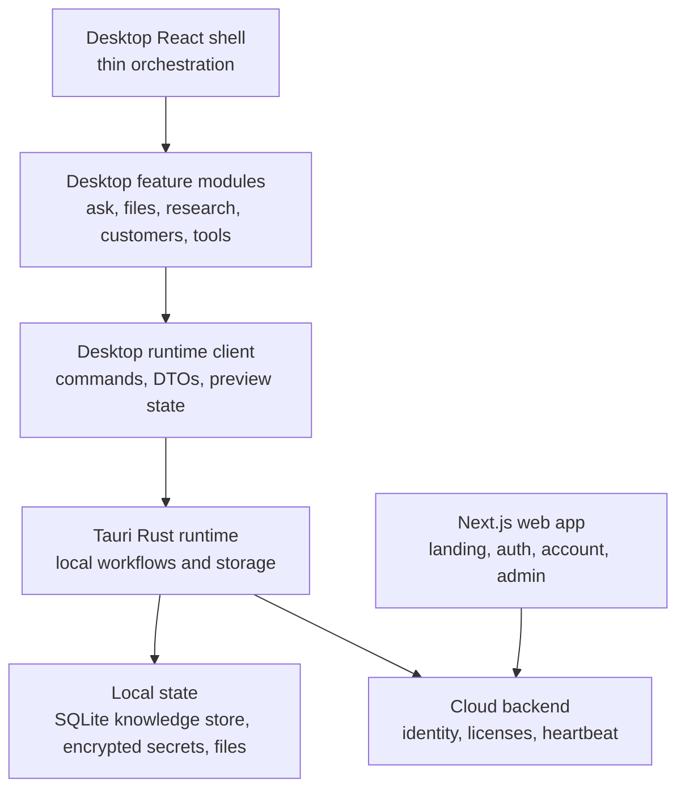

# Co-Op Codebase Audit

This audit records the current maintainability boundaries for Co-Op. It is meant to keep the product shippable as a local-first desktop app with a cloud license control plane.

## Current Boundaries

## Modularization Completed

- The former desktop shell was split into a thin orchestrator plus focused panel modules under `frontend/src/components/desktop/panels/`.
- The Money & tools surface was split into `frontend/src/components/desktop/tools/` modules for calculators, watchlist, pitch review, ownership, investors, and tab navigation.
- The desktop runtime client was split into `commands.ts`, `types.ts`, and `preview-state.ts` while preserving the stable `@/lib/desktop/runtime` import path.
- Tauri DTOs were split from one large `types.rs` file into focused modules under `frontend/src-tauri/src/types/`.
- The local knowledge store schema/migration code and tests were moved out of the production storage file.

## Size Guardrail

No source file should quietly grow into a dumping ground. Use these limits unless a deliberate exception is documented:

- Frontend screen or panel: 300 lines.
- Shared frontend utility/component module: 450 lines.
- Rust or backend domain module: 600 lines.
- DTO files: split by product domain before they become hard to review.

## Audit Snapshot

Largest files after the modularity pass:

| Area | File | Lines | Note |
| --- | --- | ---: | --- |
| Tauri storage | `frontend/src-tauri/src/knowledge_store.rs` | 599 | Public storage/search orchestration; schema and tests are split out. |
| Tauri outreach | `frontend/src-tauri/src/outreach.rs` | 587 | Lead discovery, campaign generation, and sending remain one domain module. Split next if new outreach behavior is added. |
| Tauri providers | `frontend/src-tauri/src/providers.rs` | 518 | Model, search, and email provider routing. Split before adding another provider family. |
| Tauri tools | `frontend/src-tauri/src/tools.rs` | 505 | Business calculators and pitch parsing. Split before adding new tool categories. |
| Desktop shell | `frontend/src/components/desktop/local-coop-shell.tsx` | 422 | Thin route/state orchestrator after panel extraction. |

## Ongoing Checks

- Run `npm run typecheck` after frontend boundary changes.
- Run `cargo test` after Tauri DTO, storage, provider, workflow, or validation changes.
- Run the full release checklist from `AGENTS.md` before shipping.
- Keep owner-facing product language in UI modules; avoid leaking technical terms such as RAG, vector DB, or provider internals into normal business-owner flows.
