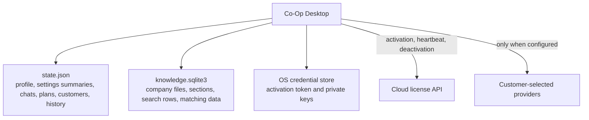
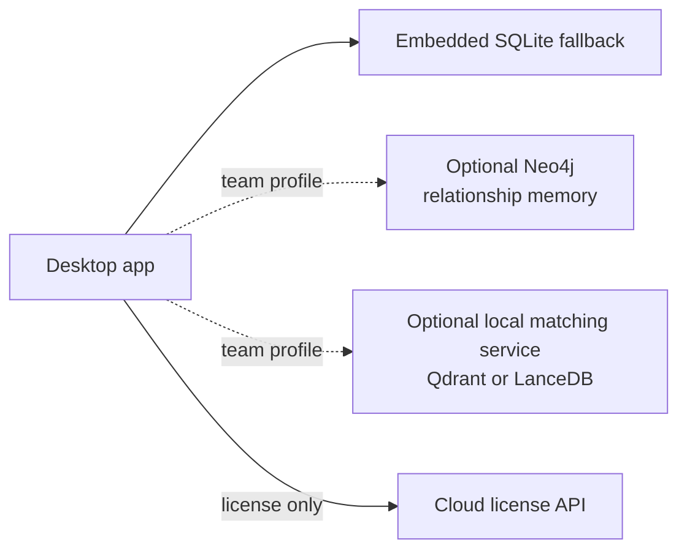

# Local Data Plane

Co-Op ships as local-first desktop software. The cloud backend is the account and license control plane. Customer business memory lives on the installed machine unless the customer explicitly configures an external AI, research, email, or integration provider.

## Default Storage Model

The default build does not require Docker, Neo4j, Qdrant, LanceDB, Turbopuffer, or a hosted matching service.

## What Ships In The Desktop Build

`state.json` stores lightweight local application state:

- Entitlement snapshot.
- Company profile and onboarding state.
- Provider setting summaries.
- Chat sessions.
- Work plan history.
- Research runs.
- Leads, campaigns, generated email status, and send status.
- Alerts.
- Pitch deck analyses.
- Cap table scenarios.
- Bookmarks.
- Integrations.
- Saved file summaries.

`knowledge.sqlite3` stores company file intelligence:

- Documents.
- Sections.
- Content hashes.
- Content sizes.
- Section order.
- Token counts.
- Full-text search rows.
- Compact deterministic matching data.
- Schema version and migrations.

OS credential storage stores:

- Activation token.
- Customer AI provider key.
- Firecrawl key.
- Resend or SendGrid key.
- Integration secrets when supported.

## File Intelligence

The embedded file store uses SQLite because it gives a stable local database without making business owners run infrastructure.

It provides:

- In-place schema upgrades.
- WAL mode for safer local writes.
- Duplicate-content handling through content hashes.
- Full-text candidate search.
- Deterministic compact matching data.
- Hybrid scoring across title, source, content, business terms, section order, and local matching.
- Bounded excerpts for chat and work plans.

This is not a cloud vector database. It is an embedded local search layer designed to be reliable on ordinary business laptops.

## Local Business Memory

`graph.rs` derives a local business memory snapshot from:

- Company profile.
- Company files.
- Research runs.
- Leads and campaigns.
- Campaign emails.
- Work history.

The UI should call this "what Co-Op remembers" or "business memory." It should not expose graph terminology to normal owners.

## Performance Rules

- Keep local collections capped before persistence.
- Bound file size and section count before indexing.
- Deduplicate repeated content.
- Limit context excerpts sent to providers.
- Prefer local embedded storage as the default path.
- Treat external memory/search services as optional derived indexes.
- Keep the app usable on normal laptops without Docker.

## Optional Self-Host Data Plane

Larger teams may eventually need a self-host profile. That should be optional and explicit.

Recommended direction:

Default:

- Embedded local state.
- Embedded local company file search.
- Derived business memory.
- No Docker.

Team self-host:

- Optional Docker Compose profile.
- Neo4j for durable relationship queries.
- Qdrant or LanceDB for larger local matching workloads.
- Health checks and fallback to embedded storage.

Enterprise:

- Customer-managed relationship/search endpoints.
- Explicit admin settings.
- Local embedded fallback.

Turbopuffer or other managed cloud search should only be used when a customer intentionally accepts that external dependency. It is not the local-first default.

## Migration Rules

- Do not move workspace data, prompts, outputs, files, or matching data into the cloud license plane.
- Do not require Docker for a normal desktop install.
- Add optional memory/search services behind explicit settings and health checks.
- Keep embedded storage as the fallback path.
- Treat external indexes as derived data.
- Keep `state.json` and `knowledge.sqlite3` as local sources of truth for the default product.

## Failure Behavior

If optional research, email, AI, or memory services are not configured:

- The feature should explain the missing setup in plain language.
- The app should not pretend work succeeded.
- Local features that do not need that service should continue working.
- No placeholder or fake result should be saved.
