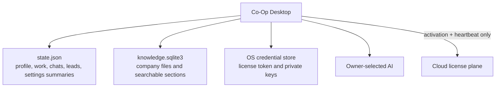

# Local Data Plane

Co-Op ships as local-first desktop software. The cloud backend is the license and account control plane; customer business memory lives on the installed machine unless the customer explicitly configures an external model, research, email, or integration provider.

## What Ships In The Desktop Build

The default desktop build does not require Docker, Neo4j, Qdrant, LanceDB, or a hosted matching service.

Runtime storage:

- `state.json` in the Tauri app data directory stores lightweight application state: workspace profile, model settings, chat history, research, outreach, campaigns, alerts, pitch analyses, cap tables, integrations, work runs, and file summaries.
- `knowledge.sqlite3` in the Tauri app data directory stores company files, saved sections, section counts, and compact binary matching data. It uses SQLite WAL mode and a full-text table to narrow search candidates before scoring.
- OS credential storage stores activation tokens and provider keys.
- `rag.rs` sections documents locally and creates deterministic 128-dimension matching data for embedded search.
- `knowledge_store.rs` owns the embedded file database, legacy JSON migration, full-text candidate filtering, compact data serialization, and local search.
- `graph.rs` derives a local business memory snapshot from workspace profile, files, research runs, leads, campaigns, campaign emails, and work history.
- Chat and work prompts receive startup workspace context, local business memory context, and optional company file context before calling the selected provider.

This means a normal business owner can install Co-Op, activate with a license key, select Ollama or an OpenAI-compatible BYOK provider, and run the product without managing databases.

## Self-Host Data Plane Option

For larger teams, a separate self-host bundle can be added later without changing the cloud license boundary:

- Neo4j for durable relationship memory, relationship queries, and hybrid relationship/file search.
- Qdrant for a Docker-friendly matching database when teams want a managed local service.
- LanceDB for embedded, file-backed matching storage when Co-Op needs more scalable local retrieval without a separate daemon.
- Turbopuffer only when a customer accepts a managed cloud/search dependency; it is not a local-first self-host default.

Recommended product shape:

- Default: embedded local state plus derived business memory, zero Docker.
- Team self-host: optional Docker Compose profile with Neo4j and a matching service.
- Enterprise: customer-managed relationship/search endpoints configured as local integrations.

## Migration Rules

- Do not move workspace, prompts, outputs, documents, or matching data into the cloud license plane.
- Do not require Docker for the normal desktop install.
- Add external memory/search services behind explicit settings and health checks.
- Keep local embedded storage as the fallback path so business work still runs if an optional service is offline.
- Treat external memory/search sync as derived data. `state.json` remains the source of truth for lightweight orchestration state; `knowledge.sqlite3` is the source of truth for local file retrieval.

## Current Limits

The embedded matching implementation is intentionally private, deterministic, and low-ops. It avoids loading every saved file section into memory, but it is lexical rather than model-generated semantic matching. Before positioning Co-Op as heavy enterprise knowledge infrastructure, add a customer-selectable embedding provider and either an embedded matching extension or an optional self-host service while preserving the local-first default.
