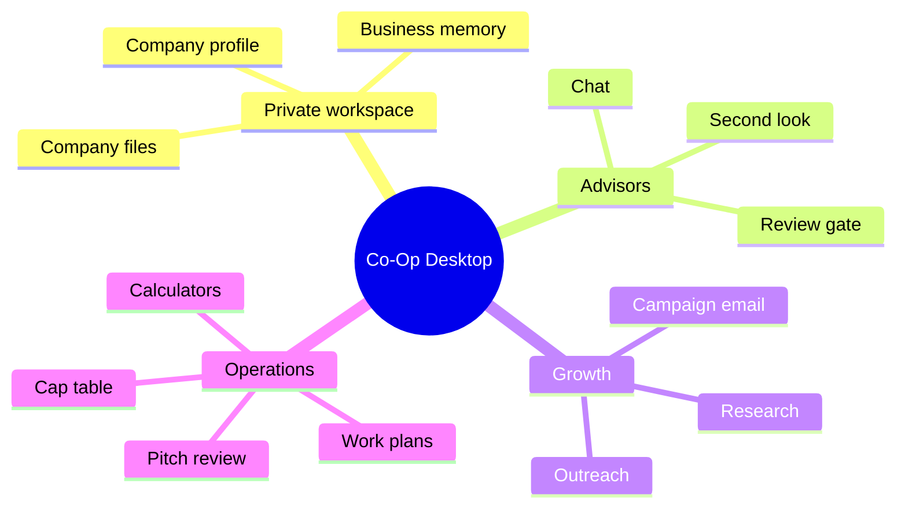

# Feature Restoration Audit

Baseline compared: old Co-Op at `c2c6994`.

Current restoration target: local-first Co-Op Desktop with cloud licensing only.

## Restored Feature Families

| Old feature family                     | Current local-first implementation                                                                                                                                                                      |
| -------------------------------------- | ------------------------------------------------------------------------------------------------------------------------------------------------------------------------------------------------------- |
| Startup workspace and onboarding       | Stored locally in the desktop state file through `save_workspace_profile`.                                                                                                                              |
| Advisor chat window                    | Restored in `/desktop` with advisor selection, session history, second-look review, company file context, research toggle, and review level.                                                            |
| Review gate                            | Restored as bounded local orchestration: no extra review, standard review, sensitive-work review, and full review using the customer-selected provider.                                                 |
| Second-look review                     | Restored in chat as a second advisor review pass when enabled.                                                                                                                                          |
| Company file intelligence              | Restored as local sectioning, SQLite-backed full-text candidate filtering, compact matching data, and local search. Files never leave the desktop unless a user routes prompts to an external provider. |
| Web research                           | Restored through customer-configured Firecrawl or model-only research. Firecrawl credentials are stored locally.                                                                                        |
| Personalized outreach                  | Restored with lead discovery, manual leads, campaigns, AI-personalized email generation, and send attempts.                                                                                             |
| Email sending                          | Restored through local customer-configured Resend or SendGrid API keys. The cloud backend does not receive campaign content or email credentials.                                                       |
| Investor database                      | Restored as a local seed database with searchable investor records.                                                                                                                                     |
| Competitor alerts                      | Restored as local alert records with manual research refresh.                                                                                                                                           |
| Pitch deck analyzer                    | Restored as local notes-based analysis through the configured model provider.                                                                                                                           |
| Cap table simulator                    | Restored as local scenario storage and validation.                                                                                                                                                      |
| Financial calculators                  | Restored for runway, burn rate, valuation, and unit economics.                                                                                                                                          |
| Bookmarks                              | Restored as local bookmark storage.                                                                                                                                                                     |
| MCP/webhook/Notion/custom integrations | Restored as local integration endpoint records.                                                                                                                                                         |
| Work history                           | Restored as local work history with status, trace, output, and errors.                                                                                                                                  |

## Cloud Boundary

The cloud backend remains intentionally narrow:

- Supabase-backed account verification
- License generation and customer self-service keys
- Device activation, heartbeat, deactivation
- License event audit records
- Health checks

Cloud does not receive:

- Business prompts
- Chat messages
- Company files
- Outreach leads
- Campaign emails
- Provider API keys
- Firecrawl keys
- Email-provider keys

## Runtime Modules

Tauri runtime is split into focused modules:

- `license.rs`
- `settings.rs`
- `workspace.rs`
- `chat.rs`
- `rag.rs`
- `knowledge_store.rs`
- `graph.rs`
- `research.rs`
- `outreach.rs`
- `tools.rs`
- `providers.rs`
- `storage.rs`
- `validation.rs`
- `security.rs`
- `types.rs`
- `constants.rs`
- `secrets.rs`

## Production Hardening

- Provider keys and activation tokens are excluded from `state.json` and stored in OS credential storage.
- Desktop state writes use a temporary file and replacement write path to reduce corrupt partial writes.
- Local collections are capped before persistence to prevent unbounded app-data growth.
- Campaign generation and sending are bounded per run and skip duplicate sent recipients.
- Provider HTTP errors are surfaced with sanitized response bodies.
- Backend rate limiting is installed globally through `ThrottlerGuard`.
- Production backend startup requires explicit `CORS_ORIGINS`, a database URL, Supabase auth config, and a strong `LICENSE_KEY_PEPPER`.

## Verification

Required checks for this restoration:

- `cargo test` in `frontend/src-tauri`
- `cargo check` in `frontend/src-tauri`
- `cargo clippy --all-targets -- -D warnings` in `frontend/src-tauri`
- `npm run typecheck` in `frontend`
- `npm run build` in `frontend`
- `npm audit --audit-level=moderate` in `frontend`
- `npm run audit:rust` in `frontend`
- `npm test` in `backend`
- `npm run build` in `backend`
- `npm audit --audit-level=moderate` in `backend`
