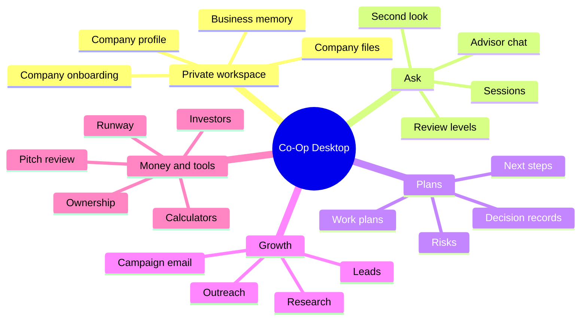

# Feature Restoration Audit

Baseline compared: old Co-Op at `c2c6994`.

Current target: local-first Co-Op Desktop with cloud licensing only.

## Restored Feature Families



## Feature Mapping

| Old feature family               | Current local-first implementation                                                                                                                             |
| -------------------------------- | -------------------------------------------------------------------------------------------------------------------------------------------------------------- |
| Startup workspace and onboarding | Stored locally through the desktop workspace profile and first-run onboarding.                                                                                 |
| Advisor chat window              | Restored with session history, advisor area selection, second-look review, company files, live research option, review level, and live progress feedback.      |
| Review gate                      | Restored as bounded local orchestration with no extra review, standard review, sensitive-work review, and full review.                                         |
| Company file intelligence        | Restored as local sectioning, SQLite-backed search, compact matching data, and bounded context assembly.                                                       |
| Business memory                  | Restored as a local derived snapshot from profile, files, research, customers, campaigns, and work history.                                                    |
| Web research                     | Restored through customer-configured Firecrawl. Outside-fact research fails closed when web sources are unavailable instead of producing model-only synthesis. Competitor work uses multiple focused searches before summary. |
| Lead discovery                   | Restored as a live-research workflow that requires source-backed extraction and local deduplication.                                                           |
| Personalized outreach            | Restored with local leads, campaigns, AI-personalized draft generation, and send status.                                                                       |
| Email sending                    | Restored through locally stored Resend or SendGrid keys.                                                                                                       |
| Investor database                | Restored as a local searchable investor surface.                                                                                                               |
| Competitor alerts                | Restored as local alert records with manual refresh.                                                                                                           |
| Pitch deck analyzer              | Restored as local file/notes analysis through the configured provider.                                                                                         |
| Cap table simulator              | Restored as local scenario storage and validation.                                                                                                             |
| Financial calculators            | Restored for runway, burn rate, valuation, and unit economics.                                                                                                 |
| Bookmarks                        | Restored as local bookmark storage.                                                                                                                            |
| Integrations                     | Restored as local endpoint records for configured services.                                                                                                    |
| Work history                     | Restored with status, trace, output, errors, and timestamps.                                                                                                   |

## Cloud Boundary

The cloud backend is intentionally narrow:

- Supabase-backed account verification.
- License generation and customer self-service keys.
- Device activation.
- Heartbeat.
- Deactivation.
- License event audit records.
- Health checks.

Cloud does not receive:

- Business prompts.
- Chat messages.
- Company files.
- Research outputs.
- Outreach leads.
- Campaign email bodies.
- Provider API keys.
- Firecrawl keys.
- Email-provider keys.

## Runtime Modules

Tauri runtime modules:

- `license.rs`
- `settings.rs`
- `workspace.rs`
- `chat.rs`
- `rag.rs`
- `knowledge_store/`
- `graph.rs`
- `guardrails.rs`
- `memory.rs`
- `memory_store.rs`
- `research.rs`
- `research_sources.rs`
- `outreach.rs`
- `tools.rs`
- `providers.rs`
- `storage.rs`
- `validation.rs`
- `security.rs`
- `secrets.rs`
- `types/`
- `constants.rs`

Frontend desktop modules:

- `local-coop-shell.tsx`
- `panels/`
- `tools/`
- `shared.tsx`
- `markdown.tsx`

## Production Hardening

- Provider keys and activation tokens are excluded from `state.json`.
- Secrets are stored in OS credential storage.
- Desktop state writes use a temporary file and replacement path to reduce corrupt partial writes.
- Local collections are capped before persistence.
- Campaign generation and sending are bounded per run and skip duplicate sent recipients.
- Provider HTTP errors are surfaced with sanitized response bodies.
- Backend rate limiting is installed globally.
- Production backend startup requires explicit `CORS_ORIGINS`, database URL, Supabase auth config, and a strong `LICENSE_KEY_PEPPER`.
- Hosted production web builds block `/desktop` and `/local`.
- Desktop activation asks business users only for an activation key.

## Remaining Product Bar

Every feature should meet these standards before release:

- Real user action, not a placeholder.
- Plain business wording.
- Clear setup recovery when a provider is missing.
- Local persistence where expected.
- Sanitized errors.
- Bounded scroll regions.
- No raw secret logging.
- Tests for validation, persistence, license, provider, or security-sensitive logic when touched.

## Verification

Required checks for this restoration:

```bash
cd backend
npm test
npm run build
npm audit --audit-level=low

cd ../frontend
npm run typecheck
npm run build
npm run build:tauri
npm audit --audit-level=low
npm run audit:rust

cd src-tauri
cargo test
cargo clippy --all-targets -- -D warnings
```

When shipping desktop software, also run:

```bash
cd frontend
npm run tauri:build
```
