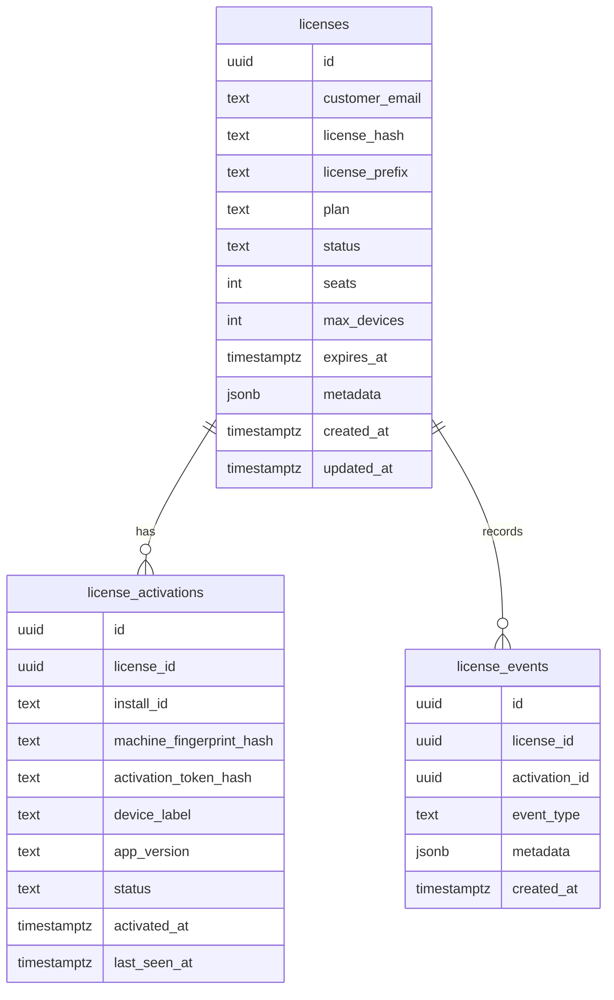
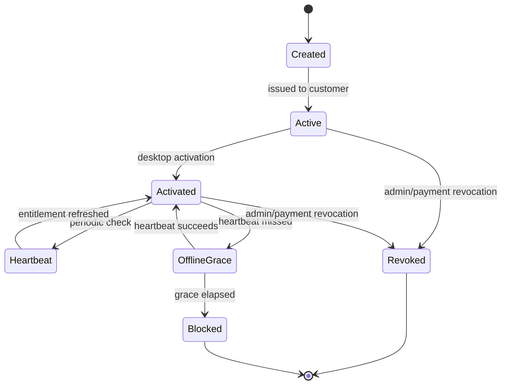

# Licensing

Co-Op uses cloud license entitlement with local desktop activation state. Customers sign in on the web to manage their account and activation key, then run the installed desktop app locally.

## Goals

- Let business users activate the desktop app with one key.
- Keep the cloud backend responsible for entitlement, device limits, revocation, and payment hooks.
- Keep business workflows, prompts, files, and outputs out of the cloud license plane.
- Store no raw license keys or activation tokens in the database.
- Allow offline work for a controlled grace window after a successful heartbeat.

## License Tables



## Stored Fields

License records store:

- Customer email.
- Keyed `license_hash`.
- Display-safe `license_prefix`.
- Plan, status, seats, and maximum devices.
- Optional expiry.
- Operator metadata.
- Creation and update timestamps.

Activation records store:

- License ID.
- Install ID.
- Machine fingerprint hash.
- Activation token hash.
- Generated device label.
- App version.
- Status.
- Activation and heartbeat timestamps.

The raw activation key is returned only at creation time and is not persisted.

## Lifecycle



1. Admin or self-service flow creates or retrieves an active license for the signed-in account.
2. Backend generates a license key and stores a keyed hash.
3. Account center shows the raw key once.
4. Desktop asks the user only for the activation key.
5. Desktop sends the key, install ID, app version, generated device label, and machine fingerprint hash to the backend.
6. Backend validates license status, expiry, and device capacity.
7. Backend returns an activation token and entitlement payload.
8. Desktop stores the activation token in OS credential storage and stores entitlement metadata locally.
9. Desktop sends heartbeat calls with the activation token and machine fingerprint hash.
10. Backend updates `last_seen_at` and returns refreshed entitlement.
11. Desktop can deactivate locally and ask the backend to mark the activation inactive.

## Endpoints

| Endpoint | Caller | Purpose |
| --- | --- | --- |
| `GET /api/v1/licenses` | Admin web user | List license records. |
| `POST /api/v1/licenses` | Admin web user | Generate an admin-issued license. |
| `GET /api/v1/licenses/mine` | Signed-in account user | Read account licenses. |
| `POST /api/v1/licenses/self-service` | Signed-in account user | Create or retrieve an account activation key. |
| `POST /api/v1/licenses/activate` | Desktop app | Activate one installed device. |
| `POST /api/v1/licenses/heartbeat` | Desktop app | Refresh entitlement and last-seen state. |
| `POST /api/v1/licenses/deactivate` | Desktop app | Deactivate the current install. |

Admin endpoints require a Supabase user whose `app_metadata.role` is `admin`. Account self-service endpoints require a valid signed-in Supabase user.

## Offline Grace

`LICENSE_OFFLINE_GRACE_DAYS` controls how long an active desktop entitlement remains usable after the latest successful heartbeat.

The desktop runtime refuses protected workflow execution when:

- License status is not active.
- License is expired.
- Activation is missing.
- Offline grace has elapsed.
- Local activation state fails validation.

The UI should explain the issue in plain language and offer a refresh or reactivation path.

## Payment Entitlement Boundary

Payment providers should update license status, expiry, plan, seats, max devices, and metadata through trusted server-side code. Payment webhooks must never expose raw activation keys or activation tokens.

Recommended payment events:

- Payment succeeded: activate or extend entitlement.
- Subscription changed: update plan, seats, max devices, or expiry.
- Payment failed: mark at risk or set a short grace period.
- Subscription canceled: set expiry or revoke at the configured business point.
- Chargeback or abuse: revoke license and record an event.

## Backfill Existing Users

If Supabase users existed before the license tables were deployed, run:

```bash
cd backend
SUPABASE_SERVICE_KEY=... npm run licenses:backfill-users
```

The script:

- Reads Supabase users with the service role key.
- Skips users that already have an active unexpired license.
- Creates one active solo license per missing user.
- Writes raw one-time activation keys to `license-backfill-*.csv`.

Treat the CSV as a secret distribution artifact. Delete it after delivery or rotate the generated keys.

## Pepper Rotation

`LICENSE_KEY_PEPPER` is part of the keyed license and activation-token hash. Rotating it invalidates existing hashes unless the backend supports dual verification during a migration window.

Do not rotate casually. Plan rotation as a security event with:

- New pepper deployment.
- Dual-read migration or license reissue strategy.
- Customer support plan.
- Audit of affected activations.

Lost activation keys should be handled by issuing a replacement key and revoking the old license. Do not build raw-key recovery.

## Logging Rules

Never log:

- Raw activation keys.
- Activation tokens.
- Machine fingerprint source values.
- Provider keys.
- Customer prompts or workflow outputs.

Log only safe identifiers such as request IDs, license prefixes, event types, and sanitized errors.
