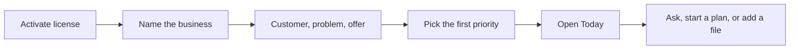
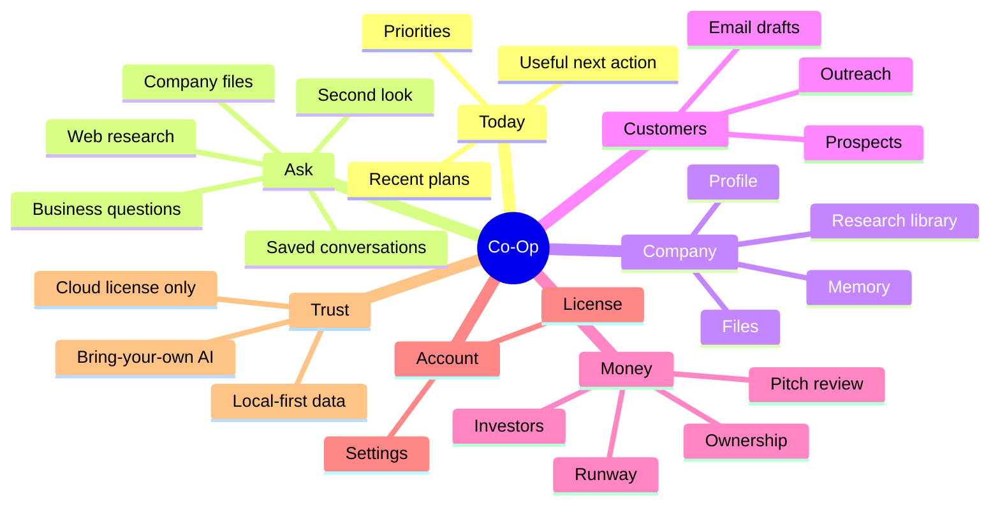

# Product Positioning

Research baseline: 2026-06-21

Co-Op is local-first business management software for owners who want one private place to plan, decide, research, follow up, and keep company context useful. The cloud exists for account, license, entitlement, payment, and software distribution. Daily business work happens in the installed desktop app.

## Audience

Primary users:

- Founder-operators.
- Small business owners.
- Independent agencies and studios.
- Early teams that need structured decisions, research, customer work, and operating follow-through.

They are not buying a developer console. They need fewer blank pages, clearer next steps, and confidence that private company context is not being pushed into a hosted workflow product by default.

## Market Signal

Comparable products show five buyer expectations:

- Shared company context should be a core feature, not a hidden technical feature.
- Useful software should turn context into actions such as plans, research, follow-ups, and reviews.
- Trust boundaries should be explicit and easy to understand.
- Onboarding should reach first value quickly instead of requiring a long setup form.
- Review and human approval matter more than unrestricted autonomy.
- Powerful work software should use progressive disclosure instead of showing every control at once.

Reference inputs:

- [Notion Enterprise Search](https://www.notion.com/help/enterprise-search)
- [ChatGPT Business](https://chatgpt.com/business/business-plan/)
- [Microsoft 365 Copilot Business](https://www.microsoft.com/en-us/microsoft-365-copilot/business)
- [Glean](https://www.glean.com/)
- [Perplexity Internal Knowledge Search](https://www.perplexity.ai/help-center/en/articles/10352914-what-is-internal-knowledge-search)
- [HubSpot Breeze AI Agents](https://www.hubspot.com/products/artificial-intelligence/breeze-ai-agents)
- [Clay](https://www.clay.com/)
- [Linear](https://linear.app/)
- [NN/g Progressive Disclosure](https://www.nngroup.com/articles/progressive-disclosure/)
- [NN/g Reducing Cognitive Load in Forms](https://www.nngroup.com/articles/4-principles-reduce-cognitive-load/)
- [NN/g Onboarding Tutorials vs. Contextual Help](https://www.nngroup.com/articles/onboarding-tutorials/)
- [LangGraph Human-in-the-Loop](https://docs.langchain.com/oss/python/langchain/human-in-the-loop)
- [OpenAI Agents SDK guide](https://developers.openai.com/api/docs/guides/agents)

## Position

Use this as the product frame:

> Co-Op is a private operating workspace for business owners. It helps plan work, use company files, research markets, prepare customer follow-up, and keep decisions accountable while business data stays on the installed app by default.

Avoid positioning Co-Op as:

- A generic chatbot.
- A hosted CRM clone.
- A developer workbench.
- A model comparison tool.
- A product that depends on cloud-hosted business workflows.

## Voice And Wording

The product should sound calm, direct, and useful.

Use:

- "Ask Co-Op"
- "Company files"
- "Business memory"
- "Memory"
- "Second look"
- "Review level"
- "AI setup"
- "Live research"
- "Customer follow-up"
- "Saved plans"
- "Money"
- "Account"

Avoid in normal UI:

- "RAG"
- "Vector"
- "Graph"
- "LLM"
- "LLM council"
- "Agent orchestration"
- "Harness"
- "Model routing"
- Generic premium claims that do not describe the product.
- Named third-party analogies that create brand or legal risk.
- Empty hype such as "10x", "magic", or "revolutionary"

Technical terms are acceptable in developer docs when they help maintainers understand the implementation.

## First-Run Journey

The first run should unlock value before exposing the full product surface.

Required first-run fields:

- Business name.
- Business stage.
- Best customer.
- Customer problem.
- What the business offers.
- First priority.

Everything else belongs behind progressive profile sections or inside the feature where it becomes useful.

## Feature Pillars

## UX Principles

- Keep the dashboard focused on work, not setup status.
- Keep the primary sidebar to owner jobs: Today, Ask, Company, Customers, and Money.
- Put Settings and License behind the account menu instead of primary navigation.
- Group company profile, files, memory, and research under Company.
- Hide completed readiness checklists when everything is ready.
- Use short interactive onboarding instead of long forms.
- Show advanced setup only where it matters, behind explicit Advanced controls.
- Make every visible button perform a real action.
- Use simple labels and consistent controls.
- Keep scroll regions bounded so one panel does not move unrelated controls.
- Let memory emerge from normal work; do not force owners into long maintenance forms.
- Prefer compact, readable layouts over dense control panels.
- Use motion only to orient the user: transitions, expansion, progress, and gentle state change.
- Treat privacy as part of the product experience.

## Product Bar

Before shipping a desktop UX change, verify:

- A non-technical owner can activate with only a license key.
- A new owner sees onboarding before the dashboard.
- The first-run flow can be completed quickly.
- The primary action on each screen is obvious.
- The primary sidebar does not expose internal modules such as file indexing, memory storage, provider routing, or license internals.
- Dashboard cards lead to working features.
- Tables and long panels scroll inside their own bounds.
- Technical terms are hidden from normal owner workflows.
- The Company memory section uses business language and avoids vector/database wording.
- Provider keys, license keys, prompts, outputs, and file content are not logged.

## Landing Page Bar

The public site should be professional and specific:

- Lead with what Co-Op does, not hype.
- Show real product screenshots or carefully anonymized screenshots from the actual UI.
- Use contact email `contact@co-op.software`.
- Avoid named comparisons that create brand or legal risk.
- Explain local-first behavior plainly.
- Link to privacy, terms, security, cookies, account, and download pages.
- Keep metadata, sitemap, robots, and `llms.txt` aligned with the public product.
