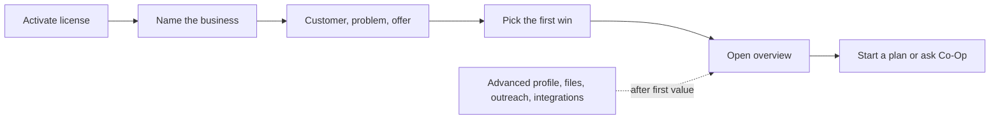
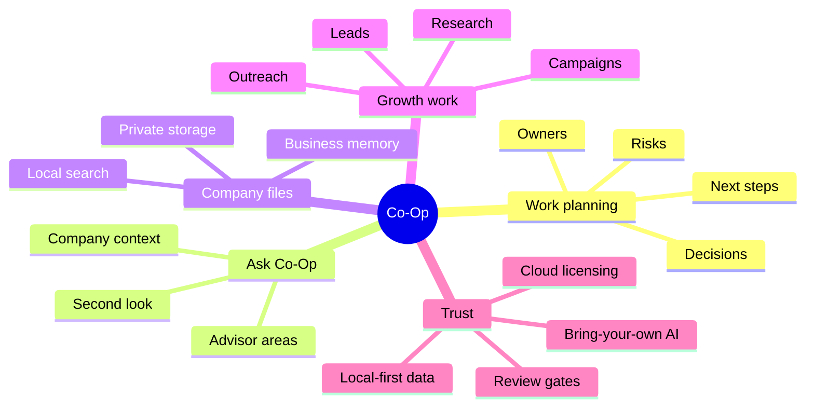

# Product Positioning

Research date: 2026-06-12

Co-Op is local-first business management software for owners who want one private place to plan, decide, research, follow up, and keep company context useful. The cloud exists for account, license, entitlement, payment, and software distribution. Daily business work stays on the installed desktop app.

## Market Signal

Comparable products point to five buyer expectations:

- Shared business context: Notion Enterprise Search and ChatGPT Business position connectors and workspace knowledge as core value, not as a hidden technical feature.
- Embedded action: HubSpot Breeze and Clay emphasize sales, marketing, service, enrichment, and growth workflows that turn data into outcomes.
- Trust by default: business AI buyers expect clear privacy boundaries, admin controls, and explicit routing of sensitive data.
- Guided setup: onboarding research favors quick first value, progressive disclosure, and contextual help over up-front education.
- Guarded autonomy: modern agent frameworks emphasize state, tracing, human review, and controlled handoffs rather than unlimited autonomous action.

Reference inputs:

- [Notion Enterprise Search](https://www.notion.com/help/enterprise-search)
- [ChatGPT Business](https://chatgpt.com/business/business-plan/)
- [HubSpot Breeze AI Agents](https://www.hubspot.com/products/artificial-intelligence/breeze-ai-agents)
- [Clay](https://www.clay.com/)
- [NN/g Progressive Disclosure](https://www.nngroup.com/articles/progressive-disclosure/)
- [NN/g Onboarding Tutorials vs. Contextual Help](https://www.nngroup.com/articles/onboarding-tutorials/)
- [LangGraph Human-in-the-Loop](https://docs.langchain.com/oss/python/langchain/human-in-the-loop)
- [OpenAI Agents SDK guide](https://developers.openai.com/api/docs/guides/agents)

## Position

Co-Op should be positioned as:

> The private operating workspace for business owners: plan work, ask questions, use company files, research markets, prepare outreach, and keep decisions accountable without putting the company workflow in a hosted AI dashboard.

Do not position Co-Op as:

- A generic chatbot.
- A hosted CRM clone.
- A multi-agent research toy.
- A developer workbench for prompts, vectors, graphs, and model debate.

## First-Run Journey

The first run should unlock value before exposing the full product surface.

Required first-run fields:

- Business name.
- Business stage.
- Best customer.
- Customer problem.
- What the business offers.
- First priority.

Everything else belongs behind progressive profile sections or in the feature where it becomes useful.

## UX Principles

- Use owner language: "company files", "business memory", "second look", "review level", "AI setup".
- Avoid internal language in the interface: "RAG", "vector", "graph", "LLM council", "agent", "model routing".
- Show only the next useful action on the overview.
- Keep advanced setup available, but do not make it the first screen.
- Treat privacy as a product feature: remind users that keys and company files stay on the computer.
- Use motion as orientation only: step transitions, progress movement, and small state changes.

## Feature Pillars

## Product Bar

Before shipping a desktop UX change, verify:

- A non-technical owner can activate with only a license key.
- A new owner sees onboarding before the dashboard.
- The first-run flow can be completed in under two minutes.
- Dashboard cards lead to working features, not placeholder screens.
- Technical terms are hidden unless the user is in setup or docs.
- Provider keys, license keys, prompts, outputs, and file content are not logged.
